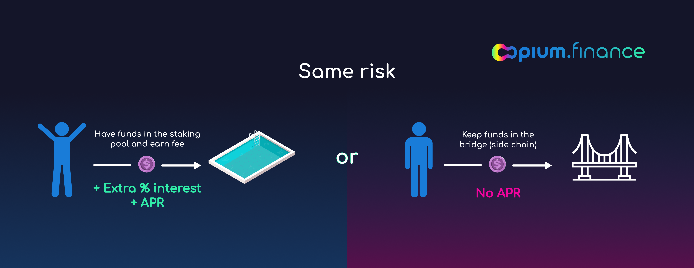

**As the importance of side-chains increases in the DeFi, we are super excited to present Bridge Protection for the largest and most solid side-chains. Based on the Opium CDS contract, our insurance is decentralized and tradable; it can be purchased as a token or sold via Opium Staking.**

[Click here to stake into or purchase Opium Bridge Protection](https://opium.finance/insurance)

---

## Side-chains vs Layer-2 — the importance of the bridge

Layer-2 solutions (L2) typically use cryptography and game theory (optimistic rollups) to ensure that off-chain transactions are properly implemented into the main net. Side-chains are usually forks of Ethereum or other blockchains, which can provide users with lower gas fees due to the specific advantages and transaction amount. There is a bridge that connects such side-chain with the main net. **It is safe to say that the side-chain is as good as its bridge.**

Side-chains are fantastic mechanisms that allow moving part of the assets and protocols out of the main Ethereum chain; however, not everybody understands that all assets of the side-chain are owned by the “bridge contract” on the Ethereum main-net.

There are several ways to secure bridges, create decentralized bridges and distribute the governance among trusted groups of people. We believe that it is the right approach and logical development for this promising scaling solution.

At the same time, we are happy to introduce our own solution to the issue, Opium Bridge Protection–tokenized and tradable decentralized insurance. Anyone bullish on the Bridge can stake money and earn fees from selling insurance, while users who seek protection can buy monthly coverage.

# Staking return — high APR for the same risk

When you stake money into the Bridge staking pool (against a specific Bridge), you earn all the fees from issuing coverage. By placing funds into the pool, you accept the risks associated with the Bridge (**just like you do when transferring the funds to a side-chain**) and receive an APR for it!

You can stake and unstake your funds monthly on the rebalancing day and resell your position in the secondary market at any time.

**Everybody from the Opium community who places their position in the AMM of Curve Finance will be eligible for a liquidity mining program.**

## Terms of protection

**Buy-side:** monthly coverage, you decide the nominal you want to cover and pay a corresponding fee. If that money is lost on the Bridge due to the fault or hack, you will get a proportional amount of the covered nominal.

**Staking pool:** you can stake at any time and unstake monthly. You can resell your position during the month via Curve Finance AMM. You earn fees paid by purchasers of the protection. If protection buyers lose money on the Bridge due to a fault or hack, you’ll lose your stake.

