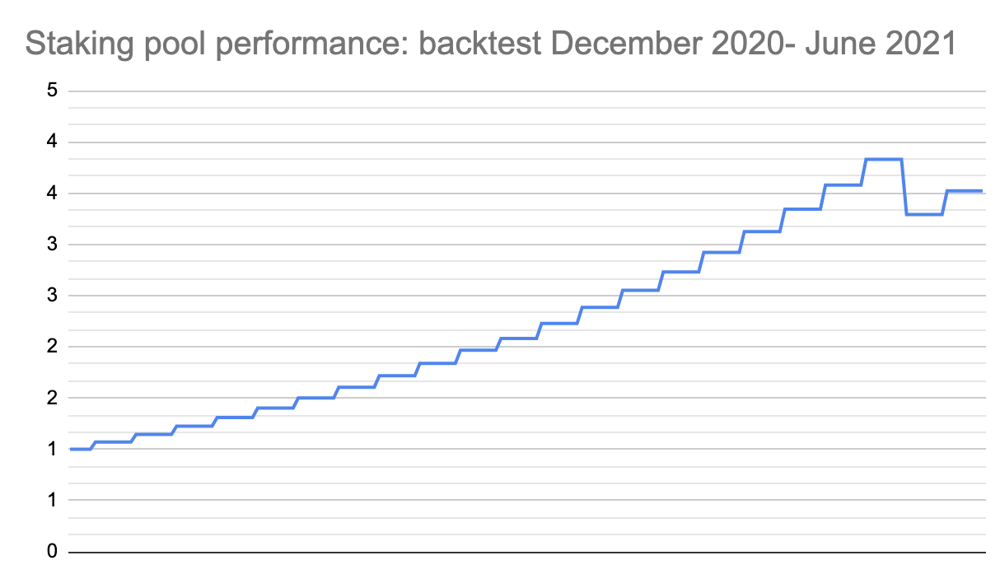
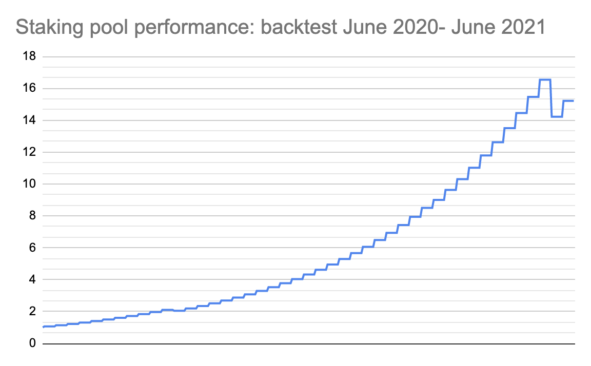

# Summary

As the last couple of weeks reminded us, crypto is a very volatile asset. A period of bull run, when ETH doubled in price almost overnight, was followed by a less stable market: now, there is more news on cryptocurrencies going down, rather than climbing up. Opium’s goal is to provide you with an appropriate tool to support your investment or trading strategy in any situation, so it’s time to introduce you to our latest product, Opium ETH Dump Protection. 

# What is ETH Dump Protection 

Protecting yourself against loss is a part of the risk management strategy. If you keep your assets in ETH, and Ether plummets overnight, that will affect your earnings, unless you take such count in such a possibility and take action. 

ETH Dump Protection is based on Protective Put, which in itself is a strategy for bearish investors who believe that the price of an asset will decline in the nearest future. However, it can be used by bullish investors to hedge against potential losses and get some protection to the downside. In this case, it works like any other decentralized insurance: you purchase protection for a premium and in case the asset drops below the strike price, you receive the difference between the strike price and the current value of ETH. 
 
For example: currently, ETH is 2,700 USD. You want to buy insurance in case its price declines, so you pay 190 USD for a weekly coverage with a strike price of 2,400 USD. If by the end of the week ETH lost some of its value and dropped to let’s say 2,100 USD, you will receive 300 USD to compensate the difference. If ETH dropped but is still above the strike price – let’s say it’s 2,600 USD – there will be no payout.

If you are bearish on an asset, you can use ETH Dump Protection as a part of the classic shortening strategy – if you believe that ETH will plummet rather than grow, purchase ETH Dump Protection and receive payouts when ETH goes down. 

# Staking pool for ETH Dump Protection 

As in all Opium products, ETH Dump Protection is covered by a liquidity pool. What is different though is the asset you stake: ETH Dump Protection pool accepts stablecoins. It makes it easier to stake money for those investors, who don't own any ETH but would like to purchase some. 

When you stake in the ETH Dump Protection pool, you are actually selling Opium the right to deliver the underlying asset to you at some point in the future, in our case within a week. 
Why would you wait a week if you can buy ETH straight away? Because staking stablecoins gives you the possibility to invest in ETH with the protection of capital. Let’s explore how it works. 

Let’s say ETH is 2,700 USD. You stake 2,700 USDT for a week, and receive 190 USDT as a premium from people, who buy ETH Dump Protection. If ETH grew or remained stable, by the end of the week you'll receive 100% of your original investment back, or 2,700 USDT.  Thanks to the premium, your weekly return will be a very solid 7%. 

If the opposite is true and ETH dropped, you’ll get a current value of ETH in USDT. Let’s assume, ETH is 2,500 USD, so you’ll receive 2,500 USDT. You still made some money: 190+2,500=2,690 USDT, or 10 USDT less than you invested. In any case, you have enough to buy ETH at its latest price. 

Staking, in this case, is a suitable strategy if your intention is to buy the underlying asset, in our case ETH. Your balance will be high enough to cover the cost, plus you have a chance of earning a return before the purchase. We explore how high this chance is in the Historical Backtest section. 
Historical Backtest 

## Historical Backtest 

To help you understand your potential gain, we have run a backtest of the current Staking pool parameters. The backtest demonstrates how the staking pool would have performed in the past (assuming the maximum utilization ratio — all offered ETH Dump Protections are bought from the pool).

The backtest results are shown below, but keep in mind that the full utilization is not likely to happen. When the pool is not fully utilized, it does not bring any downside — your assets are not at market risk, and neither do they receive interest.

Note that past performance doesn’t guarantee future results. One the graphs, you can see pool earnings growing steadily, followed by a sharp increase when the bull market started. 

### Stay tuned

Opium Protocol is a universal and robust DeFi protocol that allows for creating, settling, and trading decentralized derivatives.

[**Try out Opium Finance**](https://app.opium.finance/) or [**Explore Opium Protocol.**](https://docs.opium.network/)

Stay informed and follow [**Opium.Team on Twitter**](https://twitter.com/Opium_Network).

Did you know that you can subscribe to our [**News Channel**](https://t.me/OpiumFinance) to get more exciting news delivered to your morning coffee?

