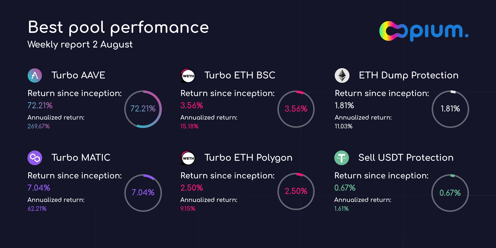
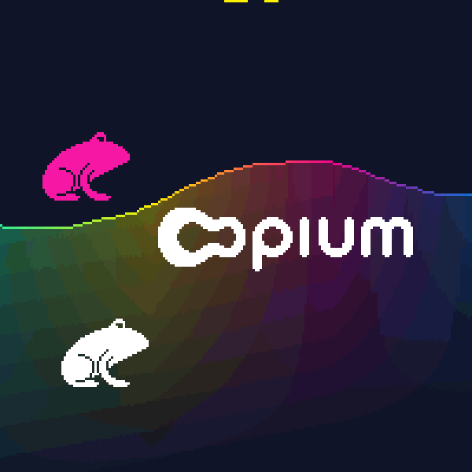
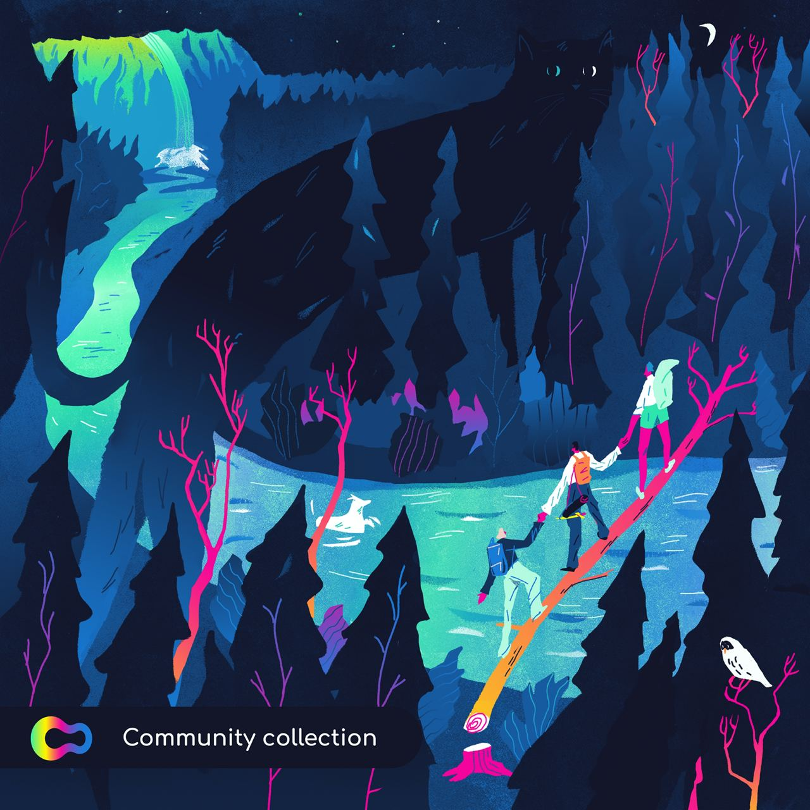
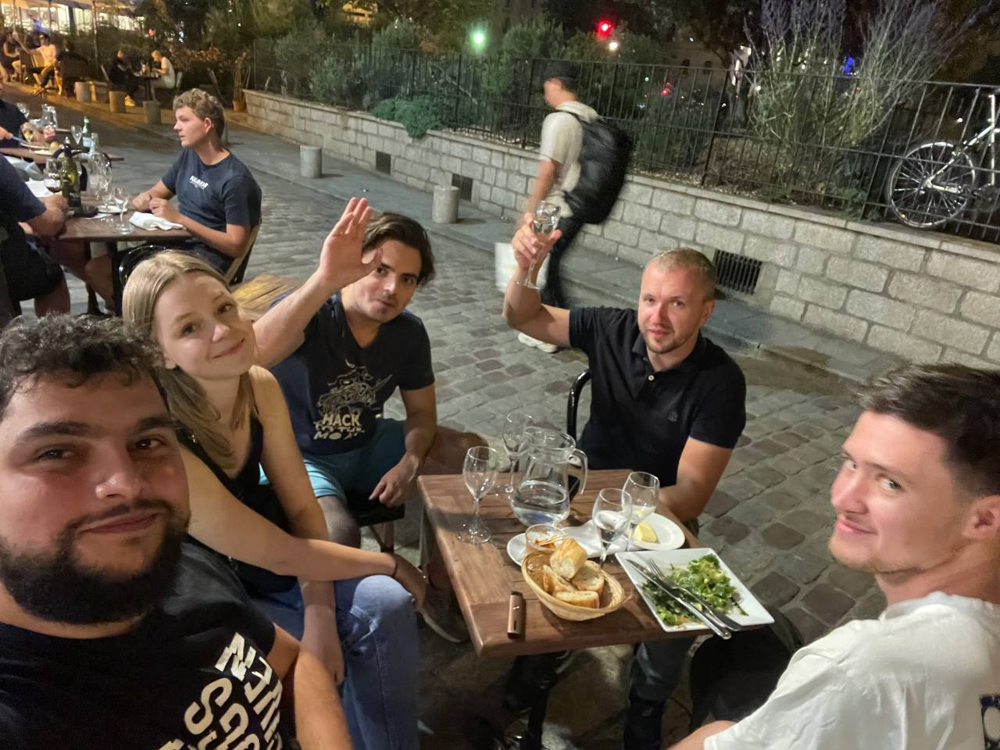

 

July has been a lovely summer month for the Opium team and the Opium community, with some exciting developments happening, meeting our passionate builders face-to-face, as well as launching some interesting new products.

Here’s a rundown of what we’ve been up to:

# Product Updates 
## Staking Pool Performance

Every Friday, we will now be posting our staking pool performance to keep users and interested parties up to date with our results. 

The ‘return since inception’ feature allows users to view the stakers total return on each pool from its inception date until the present date. 

This way, the Opium community, as well as new, prospective stakers will be able to see how our pools are performing and use the information to inform their investment decisions - but don’t forget, past performance is not a guarantee of future performance!

## SpaceX Rideshare Insurance

Due to the successful landing of the Falcon 9 at Cape Canaveral launched by SpaceX - the first reusable rocket to land successfully - stakers of our SpaceX insurance pool have enjoyed some healthy returns, receiving 100% of staked nominal and premiums on the 8th of July. 

https://twitter.com/UMAprotocol/status/1410987506313531393

Thanks, Elon!

## HOPIUM vs COPIUM NFT

One of the great idea of how to name Opium product - HOPIUM and COPIUM. Such ideas deserve NFT for sure! 

https://twitter.com/safetyth1rd/status/1402238621231435778

## NFT for bug requests

We decided to start distributing NFT’s as a reward for your help on our bug reporting program on [opium.finance](https://app.opium.finance)

People who participate in bug reporting will receive an awesome NFT for their efforts; all you need to do is use app.opium.finance and report to us any bugs you encounter. 

Check out the NFT here: [Thank you! NFT](https://opensea.io/assets/0x888888888877a56b4b809bf14bb76d63eb208297/11)

## Opium Turbo Explained

A community member and active contributor - Namaissur - created a fantastic explanation video informing users how the Opium Turbo financial product works.

By allowing a highly-leveraged exposure to an asset, you can spend a little and stand to gain a lot with Opium Turbo. 

Check out the video here: 

https://www.youtube.com/watch?v=8EhmgXbPQ6s&feature=emb_title

Show our community member some love by liking, commenting, and sharing.

## Special NFT

To say a big thank you to Namaissur for his continued support and contribution to Opium Finance, we have created a unique NFT for him as a reward.

Check it out here: https://opensea.io/assets/0x888888888877a56b4b809bf14bb76d63eb208297/12 

# Event Updates 

## First Real Conference Since Lockdown! EthCC [4]

It was an absolute pleasure to meet all of the passionate builders and community members at the EthCC week in Paris, and after receiving such positive feedback and witnessing the enthusiasm of our people, we have gained a level of traction that should keep us going until the next conference!

The 1inch X Skale boat party was certainly an event to remember and a productive one, too, with many of our brilliant community members sharing their ideas and aspirations for the project's future.

Not only this, but we got to witness the lighting of the Eiffel Tower as we started sailing, which was an extraordinary moment that we were lucky enough to share with you all. 

The investors of Rockway Fund, together with the 1inch team, made the evening additionally special by organizing a party on the rooftop of the Czech Embassy, where we got to share ideas with some great minds with the dazzling spectacle of the Eiffel Tower lit up in the background.   

https://twitter.com/rbf_cap/status/1421086730086723584?s=21

A lot had happened since our last conference before the whole world went into lockdown, and now we are emerging from it with excitement, ready to face new possibilities on the horizon. 

# We Are Hiring!
We are currently on the lookout for some talented people to join our team:

- **Executive assistant**. More info [here](https://opium-team.notion.site/Executive-assistant-Careers-at-Opium-7a32c1961c224235a846f18af4a17c73)

- **Technical manager**. More info [here](https://opium-team.notion.site/Technical-manager-areers-at-Opium-ce17ed41c8744e2ca0c28679f6e18783)

- **Chief Marketing Officer**. More info [here](https://opium-team.notion.site/Chief-Marketing-Officer-areers-at-Opium-fc70d6dfb0724ea98f51a1817598a914)

If you are interested in joining the team of Opium contributors, don't hesitate to get in touch with us on Telegram or send your requests to hi@opium.team

## Looking Forward 

We are preparing some really great products for you to look forward to.

Stay tuned!

If you have some ideas or requests relating to the improvement of the app.opium.finance interface, please share your thoughts here: [opium.canny.io](https://opium.canny.io/opium-finance-feature-request)

# About Opium

Opium Protocol is a universal and robust DeFi protocol that allows for creating, settling, and trading decentralized derivatives.

[**Try out Opium Finance**](https://app.opium.finance/) or [**Explore Opium Protocol.**](https://docs.opium.network/)

Stay informed and follow [**Opium.Team on Twitter**](https://twitter.com/Opium_Network).

Did you know that you can subscribe to our [**News Channel**](https://t.me/OpiumFinance) to get more exciting news delivered to your morning coffee?

