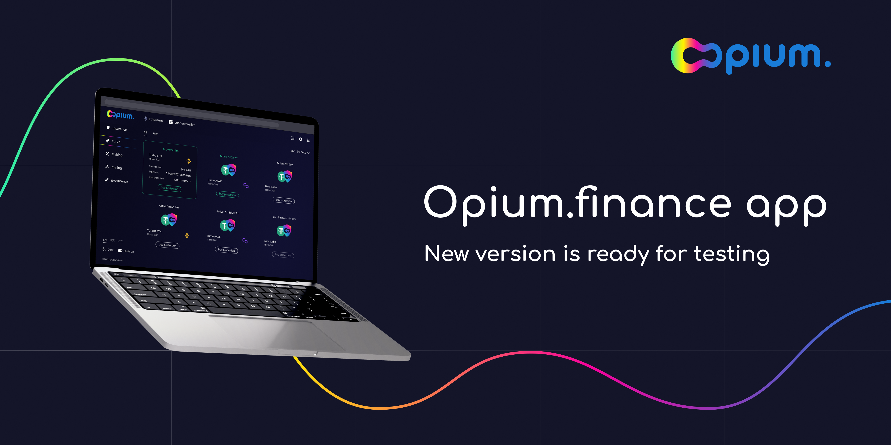
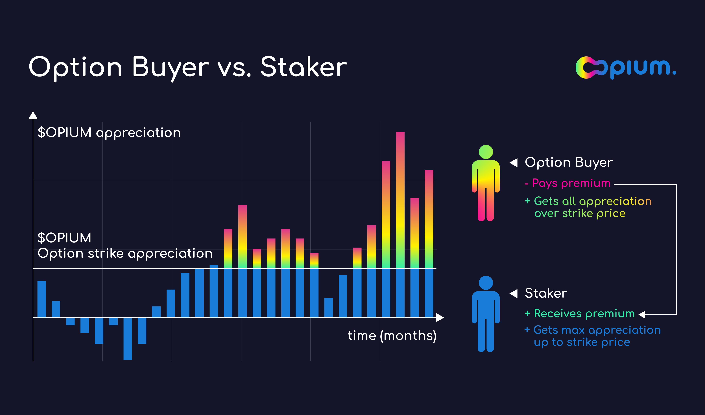

This June has been quite eventful for the Opium team and the Opium community. We have launched the new set of hyped decentralized financial tools that enable everybody to be their own banker or hedge fund manager:

# New interface of opium.finance

To bring closer mass adoption, we are working hard to make the Opium platform friendly to a user. The new version of Opium.finance is live and ready for a reality check! 

[Try it now](http://app.opium.finance)

We are inviting the community to collaborate on building the best user experience.
That's why we created [the bug report page](https://opium.canny.io).

Every person who is the first to find a bug will be rewarded with NFT from the [Opium collection](https://opensea.io/collection/opium-nft) 

# Product updates

## Call options on $OPIUM: an alternative to liquidity mining

We introduce a simpler way for $OPIUM holders to get yield on their tokens. Stake your $OPIUM to exchange future upside for premiums now or pay a fee to get xxx-leveraged upside!

A call option is a financial contract that gives the option buyer the right, but not the obligation, to buy the $OPIUM tokens at a specified price at a specific maturity date, typically from several months to a year. Seller of such option is obliged to sell $OPIUM at that specified price at maturity if desired by the buyer.

Staking $OPIUM gives you a covered position with hedged risks, popular among asset holders in traditional finance — you agree to share an upside of the future profits (if any) in return for immediate income from premiums.

[Read more](https://opium.finance/blog/opium-call-option/OpiumCallOption/)

## ETH Dump Protection

As the last couple of weeks reminded us, crypto is a very volatile asset. A period of bull run, when ETH doubled in price almost overnight, was followed by a less stable market: now, there is more news on cryptocurrencies going down, rather than climbing up. Protecting yourself against loss is a part of the risk management strategy.  

ETH Dump Protection is based on Protective Put, which in itself is a strategy for bearish investors who believe that the price of an asset will decline in the nearest future. However, it can be used by bullish investors to hedge against potential losses and get some protection to the downside. In this case, it works like any other decentralized insurance: you purchase protection for a premium and in case the asset drops below the strike price, you receive the difference between the strike price and the current value of ETH.

[Read more](https://opium.finance/blog/eth-dump-protection/ETHDumpProtection/) 

## Space X insurance 

As the value of each payload amounts to millions of dollars, satellite operators might want to have protection against a failed launch and potential destruction of the payload. There are other stakeholders that have a financial stake in the success (or failure) of a SpaceX flight, who might seek to hedge their financial risks.
To serve these users, Opium launched decentralized insurance using [UMA’s Optimistic Oracle](https://umaproject.org/). Protection was available for purchase from 14th to 24th of June with a  premium was 3% - 6% of nominal, which is more affordable than the insurance SpaceX offers; payment should be made in USDC.
 
[Read more](https://opium.finance/blog/spacex-protection/LaunchSpaceXProtection/)

## Turbo MATIC

Hyped financial product Opium Turbo now live for [$MATIC](https://polygon.technology/).
Turbo gives highly leveraged exposure to the $MATIC token.

Turbo is a product with a short expiry that gives investors highly leveraged exposure to the underlying asset. Investors buy Turbo for the fixed price, and if the underlying asset goes above the specified strike price, they’ll have an upside, earning a high return within a short period, usually a day or a week.

Turbo earns: 
- High returns on the difference above the strike price for buyers
- Up to 10% of weekly returns for stakers

## Turbo BTC

Since Opium Turbo became the flagman financial product  we were looking for the wider field of uses for it. Next to TURBO MATIC we present TURBO BTC.

- High returns for buyers
- Up to 4% return for stakers every 3 day

You can use Turbo BTC: [Stake](https://app.opium.finance/eth/staking) or [Buy](https://app.opium.finance/eth/turbo)

## Bancor Whitelisting 

Moreover, thanks to a community Opium token is  whitelisted on the [Bancor decentralized exchange](https://bancor.network/). 

You can now stake your Opium tokens:
- to provide single-sided liquidity (only $OPIUM token)
- with full impermanent loss protection (thanks to Bancor pool)

We appreciate the Bancor community for making it happen! We have distributed the coolest Opium NFT token for your active participation in building a healthy ecosystem for all the community members! 

[Check it out](https://opensea.io/assets/0x888888888877a56b4b809bf14bb76d63eb208297/9)

## Upcoming in July

New features and products are coming to opium.finance.

## Stay tuned
Opium.finance is decentralized financial platform where people create markets. Be your own banker and hedge fund manager with a wide range of сutting-edge financial products. 

Opium Protocol is a universal and robust DeFi protocol that allows for creating, settling, and trading decentralized derivatives.

Try out [Opium Finance](https://app.opium.finance) or Explore [Opium Protocol](https://opium.network).

Stay informed and [follow Opium.Team on Twitter](https://twitter.com/Opium_Network).

Did you know that you can subscribe to our [News Channel](https://t.me/OpiumFinance) to get more exciting news delivered to your morning coffee?

