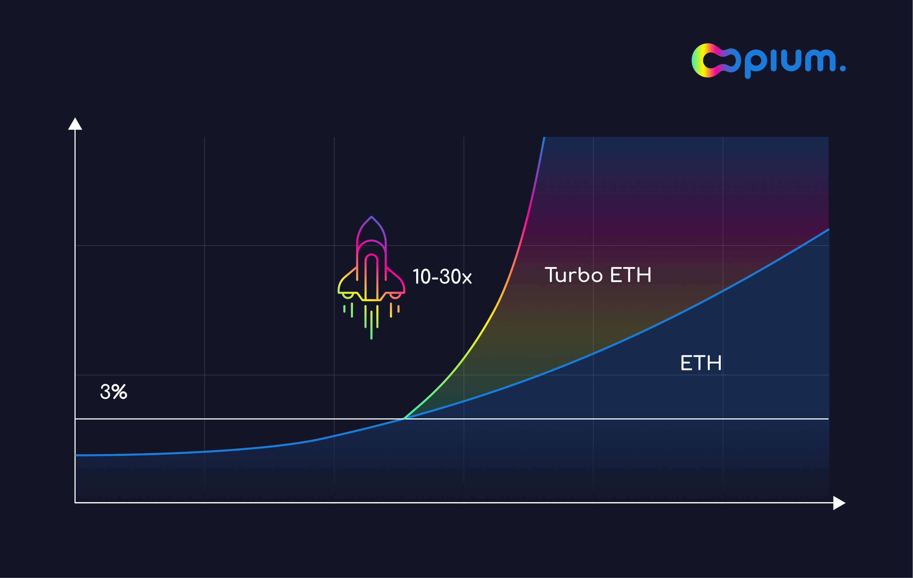
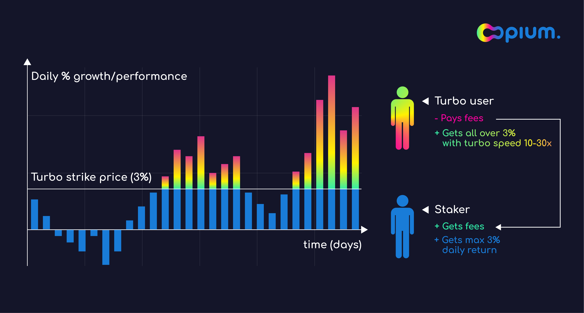

Following Opium Protocol launch on Polygon (ex-Matic) and $Opium token launch on BSC, we are thrilled to announce that Opium Protocol is now live and integrated on the Binance Smart Chain. The first live product is Opium Turbo ETH that is actively traded on Matic. Stay tuned for more gas-efficient and user-friendly derivatives.

# Opium Turbo: what is it and how it became one of the flagman products

By now, you must have heard about our last and top-rated product, **Opium Turbo ETH**. If no, here is a short recap:

Turbo ETH is a product with a short expiry — usually a day or a week — that gives you highly leveraged exposure to the underlying asset. You buy Turbo for a fixed price. If ETH goes above the strike price, you’ll have a turbo return — the difference between the actual price and the strike price within a short period (a day or a week, we have started with daily Turbos). If the ETH remains below the strike price, your Turbo will expire without a payout. The silver lining is that you can’t lose more than the cost of Turbo.

*To sum up, turbos offer a chance of a high return, which comes with a risk to lose limited funds in a short time.*

*Example: Suppose that ETH price is $4,000 and you spent $30 to buy a daily Turbo ETH with the strike of $4,100. If the price of ETH is above $4,100 by the end of the day, you will get a full difference automatically. So, if the ETH price at expiration is $4,200, Tubro ETH brings you 100$ return; if the ETH price is $4,300, you get 200$; however, if the price at expiration is $4,050, your Turbo expires without a payout.*

# Staking ETH

The pool works this way: users stake ETH into the pool to cover mining of Turbos. In return, they receive the fees from the Turbo purchasers (costs of Turbo) plus retain a daily appreciation of ETH up to 3%, while all daily appreciation above 3% goes to the Turbo purchasers. If the pool does not sell any Turbos on a specific day, the ETH will not be at market risk and retain all price appreciation. Trading of Turbos is closed 4 hours before the settlement to ensure no free-riders as the closing price of ETH at maturity is not certain. Settlement is done every day at 08:00 am UTC, like some traditional products.

By setting a 3% floor on daily appreciation, most of the time, profits from selling Turbos should cover payouts to the Turbo purchasers while effectively generating interest on crypto for stakers (see backtest below). **But be aware, though, that past results do not guarantee future performance.**

# So what role will suit you better?

Before choosing, do some research and make your calculations. If you think that daily growth on ETH above 3% sounds too good to be true, you may want to bring your crypto to the pool. As a staker, you’ll sacrifice abnormal daily returns for the proceeds from selling Turbos (3% premium on the utilized part of your funds), plus keep ETH price appreciation up to 3% per day. On the other hand, if the pool does not sell enough Turbos, your ETH is not utilized and remains in the pool without any risk associated, as they would stay in your wallet.

If you think that ETH will grow much faster than 3% per day, you can buy Turbos and hope for a very high daily return above the strike price.

# Looking forward

We will continue developing the Turbo products, which means soon you’ll see more Turbos and crypto staking will become more convenient. Let us know your opinion, and based on your feedback, we will fine-tune parameters and select additional underlying assets. Current Turbos are based on Opium Call-Options, but we also plan to introduce perpetual Turbos that you can buy and sell any time, **getting turbo speed on the moments you need.**

At the same time, we are working on Opium 2.0, which enables anyone to create financial primitives and even financial markets in one click, just by staking money — as quickly as deploying a pool on Uniswap. Plus, there will be some minor changes to the protocol to make it more user-friendly and interconnective. Will update the connections considering the latest standards, so Opium 2.0 is compatible with different order books, IMMs etc.

*We strive to bring you the easiest way to buy, sell and create. And, ultimately, let your money work for you and only you.*

# Stay tuned

Opium Protocol is a universal and robust DeFi protocol that allows for creating, settling, and trading decentralized derivatives.

[Try out Opium Finance](https://app.opium.finance/) or [Explore Opium Protocol.](https://docs.opium.network/)

Stay informed and follow [Opium.Team on Twitter](https://twitter.com/Opium_Network).

Did you know that you can subscribe to our [News Channel](https://t.me/OpiumFinance) to get more exciting news delivered to your morning coffee?
