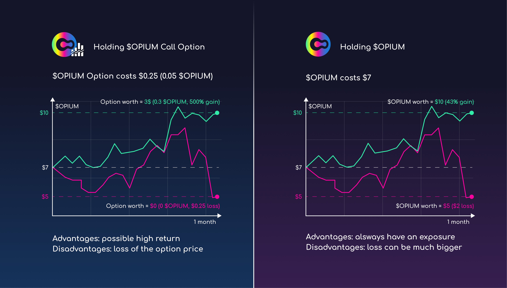
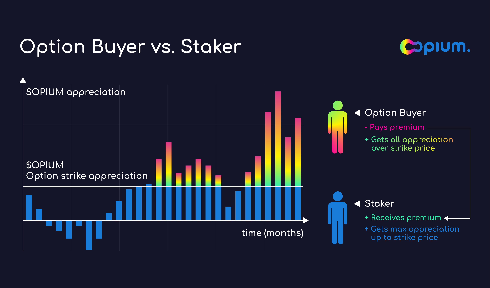

In short: [Stake your $OPIUM](https://app.opium.finance/eth/staking) to exchange future upside for premiums now or [pay a fee to get xxx-leveraged upside](https://app.opium.finance/eth/opium-products)!

Over time, in DeFi, numerous liquidity mining programs were designed and distributed hundreds of tokens in rewards. However simple we tried to make it, liquidity mining could be tricky. It involves staking other tokens together with $OPIUM, going to AMMs, risking Impermanent Losses and several other small obstacles that may have prevented some token holders from getting the most out of their tokens. **As a part of Opium Smart Farming, we are thrilled to introduce $OPIUM call options.**

# OPIUM Call Option

A call option is a financial contract that gives the option buyer the right, but not the obligation, to buy the $OPIUM tokens at a specified price at specific maturity date, typically from several months to a year. Seller of such option is obliged to sell $OPIUM at that specified price at maturity if desired by the buyer.

Traditionally, a call option buyer profits when the underlying asset increases in price. They can buy the asset at a lower price specified in the call option contract and immediately resell it at a higher price. In OPIUM, there are typically used $OPIUM-settled options, which eliminate the need to buy and then sell tokens. Suppose the price of the $OPIUM token is above the strike price at maturity. In that case, the buyer receives the entire price difference between the current price and the strike price denominated in $OPIUM tokens.

*Example:*

*$OPIUM costs 5 USD on Sushiswap, and you buy 1000 call option contracts with a strike price of 7 USD and maturity of one month. You pay in total 100 $OPIUM tokens (equal to 500 USD) for these 1000 call options.*

*You expect that the OPIUM token will increase in price notably, and you will earn the difference between the strike price and the actual price of $OPIUM when the month is over. Let’s say that by the end of the month, $OPIUM is 10 USD, which is 3 USD above the defined strike price; this means your call options will be matured, paying you 3 USD each or 3000 USD in total worth of $OPIUM. So you receive 300 extra $OPIUM tokens at maturity (3x of original option price).*

*However, if the $OPIUM token drops in price and after a month the price is, for example, 5.50 USD, it is not beneficial to execute such a call option, and they will mature without a payout.*

## $OPIUM Staking Pool

If you own $OPIUM tokens, you can stake them into the $OPIUM Call Option pool. The pool is issuing call options, effectively having a so-called covered call position. Pooled funds are used to provide coverage for the option buyers. A seller benefits when the underlying asset decreases in price as they receive the premium from the buyer and can retain their tokens. **It is a covered position with hedged risks, popular among asset holders in traditional finance — you agree to redistribute an upside of the future profits (if any) in return for immediate income from premiums.**

*Staking $OPIUM gives you a covered position with hedged risks, popular among asset holders in traditional finance — you agree to share an upside of the future profits (if any) in return for immediate income from premiums.*

If the price of the OPIUM token is above the strike price by the end of the option period, part of the pooled funds will be used for payouts to option buyers.

*Example*

*You own $OPIUM governance tokens, and you are willing to stake them in the Call Option pool. Currently, $OPIUM costs 4 USD. You stake 1000 tokens; the pool sells Call Options with a strike price of 7 USD and a maturity date within three months, for which you receive a total premium of 500 USD in $OPIUM tokens.*

*In three months, $OPIUM is 10 USD. It means the pool owes the option buyers 3 USD per contract or 3000 USD in total. Theoretically, you could sell a portion of your tokens for 3000 USD and transfer to the option buyer and still retain most of the profit. On Opium, you don’t have to sell your tokens, as the pool will transfer upside (all appretiation above the strike price) to the option buyer instead.*

*If in three months $OPIUM price is 6 USD, you retain your premium and your tokens in the likely scenario that the option buyer decides not to proceed with the trade..*

Depend on the utilisation of the staking pool you will get yield only on the tokens that are **at risk**.

### Opium KPI Options coming soon

Being partners of [UMA Protocol](https://umaproject.org/) and inspired by their [KPI Options](https://claim.umaproject.org/), we are working on another tool, OPIUM KPI Options, that are part of our Smart Opium Farm (c), and will be linked to the OPIUM performance.