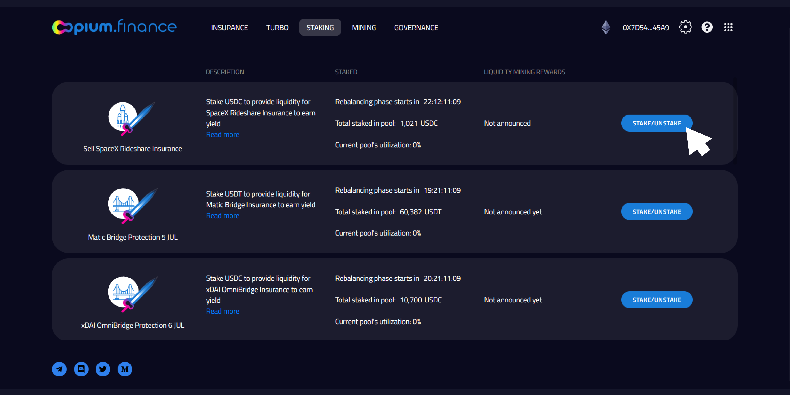
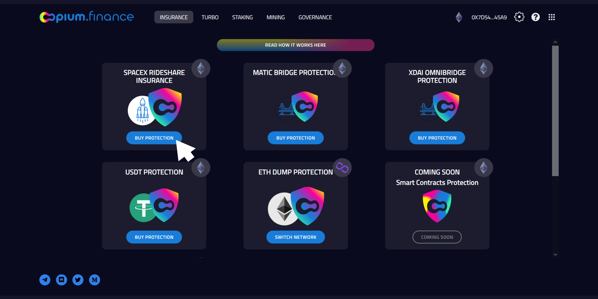

**Disclaimer**
NO INVESTMENT ADVICE

Opium and UMA combine their efforts and tools to show how off-chain data can be brought to Ethereum to grow the DeFi ecosystem. UMA’s Optimistic Oracle solution brings real-world data to Blockchain in a seamless, cheap, and fast way. Coupled with a Decentralized insurance contract (CDS) of Opium, it shows the potential to create a theoretically limitless number of new products.

## Space X launch Insurance

The stakeholders with a financial stake in the success (or failure) of a SpaceX flight could hedge their financial risks or simply speculate. 

Buying insurance will cover the following events: 

- In case of unsuccessful lift-off or launch, delayed for more than 2 weeks buyer will receive 100% of nominal
- In case of successful lift-off, followed by unsuccessful landing buyer will get 50% of nominal
- In case both lift-off and landing were successful, there will be no payout.

Staking pool payout payouts:
- Unsuccessful lift off or delayed launch (more than 2 weeks): 0% of purchased nominal + premiums
- Successful lift off, unsuccessful landing:  50% of purchased nominal + premiums
- Successful lift off, successful landing: 100% of purchased nominal + premiums

Protection for the next launch can be bought until 23 June.

### Two sides of Opium insurance

There are two sides to the Opium insurance for SpaceX:
- [Staking an asset into the liquidity pool that covers SpaceX flights protection](https://app.opium.finance/eth/staking)

- [Buying Insurance](https://app.opium.finance/eth/insurance) 

Your choice depends on your predictions and your risk appetite. 
Buyers of the derivative — a binary options contract — purchase decentralized insurance against a failed launch and pay a premium to the derivative seller. 
The derivative seller essentially offers insurance coverage against a failed launch by locking an amount of money as collateral, earning a premium in the process.

### SpaceX payloads

Earlier this year, Elon Musk introduced SpaceX SmallSat Rideshare—a program that allows multiple payload bookers to share space rides and send lighter and smaller payloads to space for as low as $1M. The very first rideshare launch named the "Transporter 1", took place on January 24, 2021, when a Falcon 9 rocket carried 143 satellites into space. The next launch is planned for 24 June. 

As the value of each payload amounts to millions of dollars, satellite operators might want to have protection against a failed launch and potential destruction of the payload. There are other stakeholders that have a financial stake in the success (or failure) of a SpaceX flight, who might seek to hedge their financial risks. 

To serve these users, Opium launched decentralized insurance using UMA’s Optimistic Oracle. Protection is available for purchase from 14 June, the maturity date is 8 July 2021 to allow for a potential delay. Premium is 3% - 6% of nominal, which is more affordable than the insurance SpaceX offers; payment should be made in USDC. 

